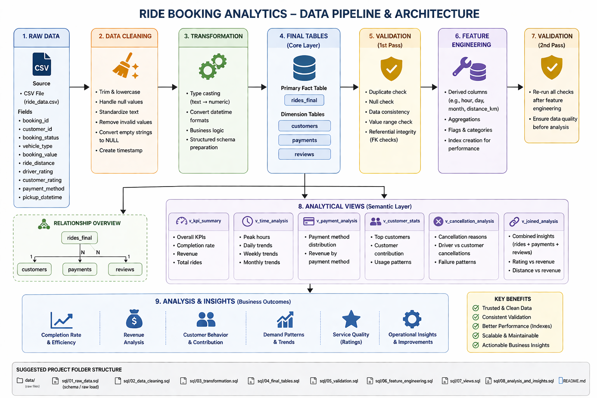

# Ride Booking Analytics (SQL Project)

## Overview

This project analyzes a ride-booking dataset using PostgreSQL to understand operational performance, revenue patterns, customer behavior, and service quality.

The work follows a structured data pipeline approach, starting from raw data and progressing through cleaning, transformation, validation, and analysis to generate actionable insights.

---

## Objectives

* Evaluate ride completion and failure patterns
* Analyze revenue distribution across payment methods and vehicle types
* Identify peak demand periods
* Understand customer contribution to revenue
* Assess service quality using ratings
* Identify operational inefficiencies

---

## Dataset Description

The dataset contains ride-level transactional data with the following attributes:

* `booking_id`: Unique identifier for each ride
* `customer_id`: Customer identifier
* `booking_status`: Ride outcome (completed, cancelled, etc.)
* `ride_timestamp`: Date and time of the ride
* `vehicle_type`: Type of vehicle selected
* `pickup_location`, `drop_location`: Ride locations
* `booking_value`: Revenue generated per ride
* `ride_distance`: Distance of the ride
* `driver_rating`, `customer_rating`: Ratings
* `payment_method`: Mode of payment

---

## Project Workflow

Raw Data → Cleaning → Transformation → Final Table → Validation → Feature Engineering → Views → Analysis

=======
### Architecture Diagram

The diagram below represents the complete data pipeline, including data ingestion, transformation, modeling, and analysis layers:



---
### Data Cleaning

* Standardized text fields (lowercase, trimming, formatting)
* Converted invalid values (empty strings, 'null') into SQL NULL
* Created a unified timestamp column (`ride_timestamp`)

### Transformation

* Converted numeric fields from TEXT to numeric types
* Created structured table (`rides`) for analysis

### Final Table Creation

* Removed duplicate bookings using window functions
* Created `rides_final` ensuring one record per booking

### Validation

* Checked for duplicates, null values, and invalid entries
* Verified completeness of key fields for completed rides

### Feature Engineering

* Handled missing values (e.g., payment method)
* Added indexes for performance optimization

### Analytical Views

Created reusable views for:

* KPI metrics
* Time-based analysis
* Payment distribution
* Customer statistics
* Cancellation patterns
* Rating vs revenue analysis

---

## Key Insights

### Ride Completion

* Completion rate is approximately 62%
* Around 38% of rides fail
* Driver cancellations are the largest contributor

Interpretation:
Failures are primarily driven by supply-side issues rather than customer behavior.

---

### Payment Trends

* UPI contributes the largest share of revenue (~45%)
* Cash remains significant (~25%)

Interpretation:
Users show a strong preference for digital payment methods.

---

### Demand Patterns

* Peak demand occurs between 5 PM and 8 PM
* Lowest activity occurs between 1 AM and 5 AM

Interpretation:
Demand aligns with daily commuting behavior.

---

### Revenue Distribution

* Revenue closely follows ride volume
* No evidence of significantly higher-value time periods

Interpretation:
Revenue is driven by volume rather than pricing differences.

---

### Vehicle Usage

* Affordable options (Auto, Go Mini) dominate usage and revenue
* Premium services contribute minimally

Interpretation:
The platform is primarily driven by cost-sensitive users.

---

### Customer Contribution

* Top 10 customers contribute approximately 9% of total revenue

Interpretation:
Revenue is distributed across a broad customer base, indicating scalability.

---

### Location Distribution

* No single pickup location dominates ride volume

Interpretation:
Demand is geographically distributed rather than concentrated.

---

### Cancellation Analysis

* Driver cancellations are the largest category
* A significant portion of failures is due to lack of driver availability

Interpretation:
Improving driver allocation and availability could significantly increase completion rates.

---

### Ratings

* Ratings are concentrated between 4.0 and 4.6
* Low ratings are rare

Interpretation:
Service quality is consistently high.

---

### Final Observation

Despite high customer satisfaction (ratings), the platform shows a relatively low completion rate.

This indicates a gap between:

* Service quality (post-ride experience)
* Operational efficiency (ride fulfillment and driver availability)

Improving supply-side operations would likely have the highest impact on overall performance.

---

## Tech Stack

* PostgreSQL
* SQL
* pgAdmin
* Git and GitHub

---

## Project Structure

```
ride-booking-analytics/
│
├── data/
│   └── rides_raw_data.csv
│
├── sql/
│   ├── 01_table_creation.sql
│   ├── 02_data_cleaning.sql
│   ├── 03_transformation.sql
│   ├── 04_final_tables.sql
│   ├── 05_validation.sql
│   ├── 06_feature_engineering.sql
│   ├── 07_views.sql
│   └── 08_analysis_and_insights.sql
│
├── architecture.png

---

## How to Run

1. Import the dataset into PostgreSQL using pgAdmin
2. Execute SQL files sequentially:

   * Table creation → Cleaning → Transformation → Final tables
   * Validation → Feature engineering → Views → Analysis
3. Review query outputs and insights

---

## Future Improvements

* Add visualization layer (Power BI / Tableau)
* Implement demand forecasting models
* Optimize driver allocation strategies
* Build real-time analytics pipeline

---

## Author
Rohit Kumar